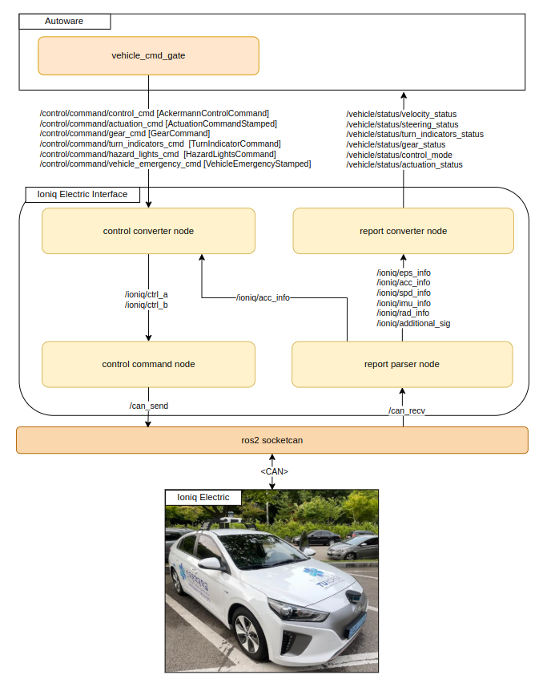

# Ioniq Electric Interface

## Overview
The Ioniq Electric Interface is a ROS 2 Humble-based vehicle interface designed for Autoware.universe. It is specifically tailored for the Hyundai Ioniq Electric (2018 Model) modified by [e-Autobahn](http://www.eautobahn.kr/) for autonomous driving research.

### Notice
> **Compatibility**: This package is optimized for **Autoware.universe v0.45.0**. Modifications may be required when using newer versions of Autoware.

> **Development Tool & Reference**: Core logic was generated using Pixmoving [vehicle_ros_driver_generator](https://github.com/pixmoving-moveit/vehicle_ros_driver_generator), inspired by [pix_driver](https://github.com/pixmoving-moveit/pix_driver).

> **Vehicle Compatibility**: Designed exclusively for vehicles modified by [e-Autobahn](http://www.eautobahn.kr/). **Not compatible** with stock Ioniq models.

> **Dependency**: Requires [ros2_socketcan](https://github.com/autowarefoundation/ros2_socketcan/) to be running.

> **Disclaimer**: By utilizing this software, you acknowledge and agree to the terms specified in the [DISCLAIMER.md](./DISCLAIMER.md) file.

## Role
There are three main functions for ioniq_electric_interface:
- **Translation between CAN frames and ioniq_electric_msgs**
- **Conversion of Autoware commands to ioniq_electric_msgs**
- **Conversion of vehicle status in ioniq_electric_msgs to Autoware messages**
  
## Software Design

---

## Control Command Node

### Input

| Input | Topic (Data Type) | Explanation |
| --- | --- | --- |
| Control A | `/ioniq/ctrl_a` ([ioniq_electric_msgs/msg/CtrlA](./ioniq_electric_msgs/msg/CtrlA.msg)) | High-level enable and mode controls |
| Control B | `/ioniq/ctrl_b` ([ioniq_electric_msgs/msg/CtrlB](./ioniq_electric_msgs/msg/CtrlB.msg)) | Actuation commands (Steer, Accel) |

### Output

| Output | Topic (Data Type) | Explanation |
| --- | --- | --- |
| CAN Frame | `/can_send` ([can_msgs/msg/Frame](http://docs.ros.org/en/melodic/api/can_msgs/html/msg/Frame.html)) | Raw CAN frames to Socket CAN |

#### CtrlA
| Content | Data Type | Explanation |
| --- | --- | --- |
| eps_en | bool | Enable/disable steering control |
| eps_override_ignore | bool | Ignore Driver steering override |
| eps_speed | int32 | Steering speed [10-250] |
| acc_en | bool | Enable/disable longitudinal control |
| aeb_en | bool | Enable/disable AEB |
| aliv_cnt | int32 | Alive counter [0-255] |
| aeb_decel_value | float32 | AEB deceleration value [g] |
| acc_override_ignore | bool | Ignore Driver accel override |
| gear_sel | int32 | Target gear `{0: P, 5: D, 6: N, 7: R}` |
| turn_signal | int32 | Turn signal `{0: None, 1: Right, 2: Hazard, 4: Left}` |

#### CtrlB
| Content | Data Type | Explanation |
| --- | --- | --- |
| eps_cmd | float32 | Target steering angle [deg] [-500 to 500] |
| acc_cmd | float32 | Target acceleration [m/s^2] [-3 to 1] |

---

## Report Parser Node

### Input

| Input | Topic (Data Type) | Explanation |
| --- | --- | --- |
| CAN Frame | `/can_recv` ([can_msgs/msg/Frame](http://docs.ros.org/en/melodic/api/can_msgs/html/msg/Frame.html)) | Raw CAN frames from Socket CAN |

### Output

| Output | Topic (Data Type) | Explanation |
| --- | --- | --- |
| EPS Info | `/ioniq/eps_info` ([ioniq_electric_msgs/msg/EpsInfo](./ioniq_electric_msgs/msg/EpsInfo.msg)) | Steering system status |
| ACC Info | `/ioniq/acc_info` ([ioniq_electric_msgs/msg/AccInfo](./ioniq_electric_msgs/msg/AccInfo.msg)) | Longitudinal, gear and turn signal status |
| Speed Info | `/ioniq/spd_info` ([ioniq_electric_msgs/msg/SpdInfo](./ioniq_electric_msgs/msg/SpdInfo.msg)) | Wheel speed information |
| IMU Info | `/ioniq/imu_info` ([ioniq_electric_msgs/msg/ImuInfo](./ioniq_electric_msgs/msg/ImuInfo.msg)) | Lateral accel, yaw rate, brake cylinder |
| Radar Info | `/ioniq/rad_info` ([ioniq_electric_msgs/msg/RadInfo](./ioniq_electric_msgs/msg/RadInfo.msg)) | Radar object tracking data |
| Additional Sig | `/ioniq/additional_sig` ([ioniq_electric_msgs/msg/AdditionalSig](./ioniq_electric_msgs/msg/AdditionalSig.msg)) | Pedal position and steering rate |

---

## Control Converter Node

### Input

| Input | Topic (Data Type) | Explanation |
| --- | --- | --- |
| Control Command | `/control/command/control_cmd` ([autoware_control_msgs/msg/Control](https://github.com/autowarefoundation/autoware_msgs/blob/main/autoware_control_msgs/msg/Control.msg)) | Targets for acceleration and steering |
| Actuation Command | `/control/command/actuation_cmd` ([tier4_vehicle_msgs/msg/ActuationCommandStamped](https://github.com/tier4/tier4_autoware_msgs/blob/tier4/universe/tier4_vehicle_msgs/msg/ActuationCommandStamped.msg)) | Raw steering command values |
| Gear Command | `/control/command/gear_cmd` ([autoware_vehicle_msgs/msg/GearCommand](https://github.com/autowarefoundation/autoware_msgs/blob/main/autoware_vehicle_msgs/msg/GearCommand.msg)) | Autoware gear command (P, R, N, D) |
| Engage | `/api/autoware/get/engage` ([autoware_vehicle_msgs/msg/Engage](https://github.com/autowarefoundation/autoware_msgs/blob/main/autoware_vehicle_msgs/msg/Engage.msg)) | Autoware engage command |
| Turn Indicators | `/control/command/turn_indicators_cmd` ([autoware_vehicle_msgs/msg/TurnIndicatorsCommand](https://github.com/autowarefoundation/autoware_msgs/blob/main/autoware_vehicle_msgs/msg/TurnIndicatorsCommand.msg)) | Turn signal control (Left/Right) |
| Hazard Lights | `/control/command/hazard_lights_cmd` ([autoware_vehicle_msgs/msg/HazardLightsCommand](https://github.com/autowarefoundation/autoware_msgs/blob/main/autoware_vehicle_msgs/msg/HazardLightsCommand.msg)) | Hazard light control |
| Emergency Command | `/control/command/vehicle_cmd_emergency` ([tier4_vehicle_msgs/msg/VehicleEmergencyStamped](https://github.com/tier4/tier4_autoware_msgs/blob/tier4/universe/tier4_vehicle_msgs/msg/VehicleEmergencyStamped.msg)) | Emergency stop command |
| Operation Mode | `/api/operation_mode/state` ([autoware_adapi_v1_msgs/msg/OperationModeState](https://github.com/autowarefoundation/autoware_adapi_msgs/blob/main/autoware_adapi_v1_msgs/msg/OperationModeState.msg)) | Current operation mode status |
| Acc Info | `/ioniq/acc_info` ([ioniq_electric_msgs/msg/AccInfo](./ioniq_electric_msgs/msg/AccInfo.msg)) | Vehicle feedback for gear and acceleration |

### Output

| Output | Topic (Data Type) |
| --- | --- |
| Control A | `/ioniq/ctrl_a` ([ioniq_electric_msgs/msg/CtrlA](./ioniq_electric_msgs/msg/CtrlA.msg)) |
| Control B | `/ioniq/ctrl_b` ([ioniq_electric_msgs/msg/CtrlB](./ioniq_electric_msgs/msg/CtrlB.msg)) |

### Service

| Service | Data Type | Explanation |
| --- | --- | --- |
| Control Mode Request | `/control/control_mode_request` ([autoware_vehicle_msgs/srv/ControlModeCommand](https://github.com/autowarefoundation/autoware_msgs/blob/main/autoware_vehicle_msgs/srv/ControlModeCommand.srv)) | Switches between Manual and Autonomous modes |

## Report Converter Node

### Input

| Input | Topic (Data Type) |
| --- | --- |
| EPS Info | `/ioniq/eps_info` |
| ACC Info | `/ioniq/acc_info` |
| Speed Info | `/ioniq/spd_info` |
| IMU Info | `/ioniq/imu_info` |

### Output

| Output (to Autoware) | Topic (Data Type) | Explanation |
| --- | --- | --- |
| Control Mode | `/vehicle/status/control_mode` ([autoware_vehicle_msgs/msg/ControlModeReport](https://github.com/autowarefoundation/autoware_msgs/blob/main/autoware_vehicle_msgs/msg/ControlModeReport.msg)) | Vehicle control mode status |
| Velocity Status | `/vehicle/status/velocity_status` ([autoware_vehicle_msgs/msg/VelocityReport](https://github.com/autowarefoundation/autoware_msgs/blob/main/autoware_vehicle_msgs/msg/VelocityReport.msg)) | Longitudinal velocity |
| Steering Status | `/vehicle/status/steering_status` ([autoware_vehicle_msgs/msg/SteeringReport](https://github.com/autowarefoundation/autoware_msgs/blob/main/autoware_vehicle_msgs/msg/SteeringReport.msg)) | Steering tire angle |
| Gear Status | `/vehicle/status/gear_status` ([autoware_vehicle_msgs/msg/GearReport](https://github.com/autowarefoundation/autoware_msgs/blob/main/autoware_vehicle_msgs/msg/GearReport.msg)) | Current gear position |
| Turn Indicators | `/vehicle/status/turn_indicators_status` ([autoware_vehicle_msgs/msg/TurnIndicatorsReport](https://github.com/autowarefoundation/autoware_msgs/blob/main/autoware_vehicle_msgs/msg/TurnIndicatorsReport.msg)) | Turn signal status |
| Hazard Lights | `/vehicle/status/hazard_lights_status` ([autoware_vehicle_msgs/msg/HazardLightsReport](https://github.com/autowarefoundation/autoware_msgs/blob/main/autoware_vehicle_msgs/msg/HazardLightsReport.msg)) | Hazard lights status |
| Actuation Status | `/vehicle/status/actuation_status` ([tier4_vehicle_msgs/msg/ActuationStatusStamped](https://github.com/tier4/tier4_autoware_msgs/blob/tier4/universe/tier4_vehicle_msgs/msg/ActuationStatusStamped.msg)) | Accel, brake, and steer status |

---

## Reference
- [Autoware.universe](https://github.com/autowarefoundation/autoware.universe)
- [pix_driver](https://github.com/pixmoving-moveit/pix_driver)
- [ros2_socketcan](https://github.com/autowarefoundation/ros2_socketcan)
- [tier4_autoware_msgs](https://github.com/tier4/tier4_autoware_msgs)
- [vehicle_ros_driver_generator](https://github.com/pixmoving-moveit/vehicle_ros_driver_generator)
